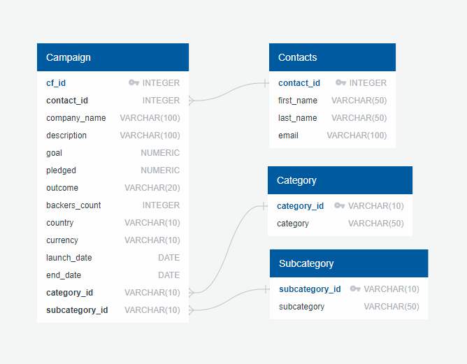

# Crowdfunding_ETL

## Group 1:
Isaac Rodriguez Ocampo  
John James  
Sara Parveen  
Victor Dontsov  

This mini group project focuses on building an ETL pipeline using Python, Pandas, and either Python dictionary methods or regular expressions to extract and transform the data. After transforming the data, four CSV files are created and the CSV file data is used to create an ERD and a table schema. Finally, the CSV file data is uploaded into a Postgres database.

## Solution files
[Jupyter Notebook file](ETL_Mini_Project_Solution.ipynb)  
[ERD](Crowdfunding_db/crowdfunding_db_ERD.png)  
[Schema](Crowdfunding_db/crowdfunding_db_schema.sql)  
[PostgreSQL - Contacts table](Crowdfunding_db/Contacts_SELECT_Screenshot.PNG)  
[PostgreSQL - Category table](Crowdfunding_db/Category_SELECT_Screenshot.PNG)  
[PostgreSQL - Subcategory table](Crowdfunding_db/Subcategory_SELECT_Screenshot.PNG)  
[PostgreSQL - Campaign table](Crowdfunding_db/Campaign_SELECT_Screenshot.PNG)

The *Resources* folder contains the two Microsoft Excel files named *crowdfunding.xlsx* and *contacts.xlsx* containing the starting data provided for the project and the four CSV files created as a result of ETL.

The project comprises of the following subsections:

1. Create the Category and Subcategory DataFrames
2. Create the Campaign DataFrame
3. Create the Contacts DataFrame
4. Create the Crowdfunding Database

## PART 1: Create the Category and Subcategory DataFrames

This subsection is completed by performing the following steps:

- Extract and transform the *crowdfunding.xlsx* Excel data to create a category DataFrame that has the following columns:

    - A "category_id" column that has entries going sequentially from "cat1" to "catn", where n is the number of unique categories and is equal to 9

    - A "category" column that contains only the category titles

- Export the category DataFrame as *category.csv* and save it.

- Extract and transform the *crowdfunding.xlsx* Excel data to create a subcategory DataFrame that has the following columns:

    - A "subcategory_id" column that has entries going sequentially from "subcat1" to "subcatn", where n is the number of unique subcategories and is equal to 24

    - A "subcategory" column that contains only the subcategory titles

- Export the subcategory DataFrame as *subcategory.csv* and save it.

## PART 2: Create the Campaign DataFrame

This subsection is completed by performing the following steps:

- Extract and transform the *crowdfunding.xlsx* Excel data to create a campaign DataFrame that has the following columns:

    - The "cf_id" column

    - The "contact_id" column

    - The "company_name" column

    - The "blurb" column, renamed to "description"

    - The "goal" column, converted to the float data type

    - The "pledged" column, converted to the float data type

    - The "outcome" column

    - The "backers_count" column

    - The "country" column

    - The "currency" column

    - The "launched_at" column, renamed to "launch_date" and with the UTC times converted to the datetime format

    - The "deadline" column, renamed to "end_date" and with the UTC times converted to the datetime format

    - The "category_id" column, with unique identification numbers matching those in the "category_id" column of the category DataFrame

    - The "subcategory_id" column, with the unique identification numbers matching those in the "subcategory_id" column of the subcategory DataFrame

- Export the campaign DataFrame as *campaign.csv* and save it.

## PART 3: Create the Contacts DataFrame

This subsection can be completed by extracting and transforming the data from *contacts.xlsx* Excel by using two options. The solution file contains both options.

### *Option 1: Use Python dictionary methods:

This option is completed by performing the following steps:

- Import the *contacts.xlsx* file into a DataFrame.

- Iterate through the DataFrame, converting each row to a dictionary.

- Iterate through each dictionary, doing the following:

    - Extract the dictionary values from the keys by using a Python list comprehension.

    - Add the values for each row to a new list.

- Create a new DataFrame that contains the extracted data.

- Split each "name" column value into a first and last name, and place each in a new column.

- Clean and export the DataFrame as *contacts.csv a*nd save it.

### *Option 2: Use regular expressions:

This option is completed by performing the following steps:

- Import the *contacts.xlsx* file into a DataFrame.

- Extract the "contact_id", "name", and "email" columns by using regular expressions.

- Create a new DataFrame with the extracted data.

- Convert the "contact_id" column to the integer type.

- Split each "name" column value into a first and a last name, and place each in a new column.

- Clean and then export the DataFrame as *contacts.csv* and save it.

## PART 4: Create the Crowdfunding Database

This subsection is completed by performing the following steps which are saved in *Crowdfunding_db* folder:

- Inspect the four CSV files, and then sketch an ERD of the tables by using QuickDBDLinks to an external site. The ERD image is saved.

  

- Use the information from the ERD to create a table schema for each CSV file.

- Sspecify the data types, primary keys, foreign keys, and other constraints.

- Save the database schema as a Postgres file named *crowdfunding_db_schema.sql*, and save it.

- Create a new Postgres database, named *crowdfunding_db*.

- Using the database schema, create the tables in the correct order to handle the foreign keys.

- Verify the table creation by running a SELECT statement for each table.

- Import each CSV file into its corresponding SQL table.

- Verify that each table has the correct data by running a SELECT statement for each.

  
  
  
